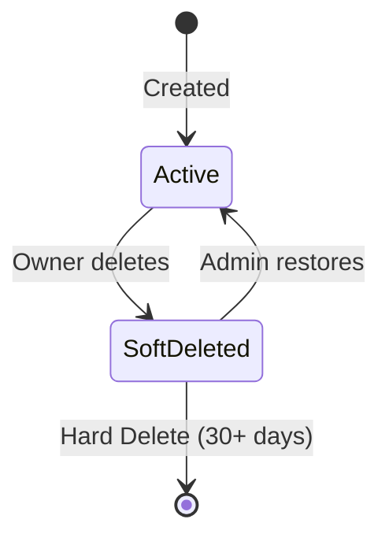

# Module 2 - Quick Reference Guide

## 🚀 Quick Start

### Creating a Workspace
```python
from app.services.workspace import WorkspaceService
from app.schemas.workspace import WorkspaceCreate

workspace_data = WorkspaceCreate(
    name="My Workspace",
    description="My team workspace"
)

workspace = WorkspaceService.create_workspace(db, workspace_data, user_id)
```

### Inviting Members
```python
from app.services.workspace import WorkspaceInvitationService
from app.schemas.workspace import WorkspaceInvitationCreate

invitation_data = WorkspaceInvitationCreate(
    email="user@example.com",
    invited_role="member"
)

invitation = WorkspaceInvitationService.create_invitation(
    db, workspace_id, inviter_user_id, invitation_data
)
```

### Switching Context
```python
# Log workspace access
WorkspaceAccessLogService.log_access(db, workspace_id, user_id)

# Get last accessed workspace
last_workspace = WorkspaceAccessLogService.get_last_accessed_workspace(db, user_id)
```

## 📡 API Examples

### Create Workspace
```bash
POST /api/v1/workspaces
Authorization: Bearer <token>
Content-Type: application/json

{
  "name": "PronaFlow Team",
  "description": "Main workspace"
}
```

### Accept Invitation
```bash
POST /api/v1/workspaces/invitations/accept?token=<invitation_token>
Authorization: Bearer <token>
```

### Get Last Accessed
```bash
GET /api/v1/workspaces/me/last-accessed
Authorization: Bearer <token>
```

### Admin: List Deleted Workspaces
```bash
GET /api/v1/admin/workspaces/deleted?older_than_days=30
Authorization: Bearer <admin_token>
```

### Admin: Restore Workspace
```bash
POST /api/v1/admin/workspaces/{workspace_id}/restore
Authorization: Bearer <admin_token>
```

## 🔑 Permission Matrix

| Action | Owner | Admin | Member | Viewer |
|--------|-------|-------|--------|--------|
| View workspace | ✅ | ✅ | ✅ | ✅ |
| Edit workspace | ✅ | ✅ | ❌ | ❌ |
| Delete workspace | ✅ | ❌ | ❌ | ❌ |
| Invite members | ✅ | ✅ | ❌ | ❌ |
| Remove members | ✅ | ✅ | ❌ | ❌ |
| Change roles | ✅ | ✅ | ❌ | ❌ |
| Create projects | ✅ | ✅ | ❌ | ❌ |
| Manage billing | ✅ | ❌ | ❌ | ❌ |

## 🛠️ Validation Rules

### Workspace Name
- ✅ Length: 2-50 characters
- ✅ Must contain alphanumeric characters
- ✅ No profanity
- ✅ No URLs
- ✅ No excessive repetition

### Error Codes
- `WS_001`: Invalid workspace name
- `WS_002`: Name too long (>50 chars)
- `WS_003`: Name too short (<2 chars)
- `WS_004`: Description too long (>500 chars)
- `WS_005`: Description contains inappropriate content
- `WS_006`: Invalid timezone
- `WS_007`: Invalid work days
- `WS_008`: Invalid work hours format

## 🔄 Lifecycle States



## 📊 Data Models

### Workspace
```python
{
    "id": "uuid",
    "name": "string (max 50)",
    "description": "string (optional)",
    "owner_id": "uuid",
    "status": "ACTIVE | SOFT_DELETED",
    "is_deleted": "boolean",
    "deleted_at": "datetime | null",
    "created_at": "datetime",
    "updated_at": "datetime"
}
```

### WorkspaceMember
```python
{
    "id": "uuid",
    "workspace_id": "uuid",
    "user_id": "uuid",
    "role": "owner | admin | member | viewer | guest",
    "is_active": "boolean",
    "left_at": "datetime | null",
    "created_at": "datetime"
}
```

### WorkspaceInvitation
```python
{
    "id": "uuid",
    "workspace_id": "uuid",
    "email": "string",
    "invited_by": "uuid",
    "invited_role": "admin | member | viewer",
    "token_hash": "string",
    "expires_at": "datetime (+48h)",
    "accepted_at": "datetime | null",
    "created_at": "datetime"
}
```

## 🎯 Common Use Cases

### 1. New User Registration
```
1. User completes registration
2. System creates default workspace "{username}'s Workspace"
3. User is added as Owner
4. Default settings created
```

### 2. Team Invitation
```
1. Owner/Admin sends invitation
2. System generates 48h token
3. Invitee receives email with magic link
4. Invitee clicks link, accepts invitation
5. Invitee added as workspace member
```

### 3. Context Switching
```
1. User switches to Workspace B
2. System logs access
3. Dashboard reloads with Workspace B data
4. All queries filter by workspace_id
```

### 4. Workspace Deletion & Recovery
```
1. Owner soft-deletes workspace
2. Workspace hidden from all users
3. Data retained for 30 days
4. Admin can restore within 30 days
5. After 30 days, auto-purge eligible
```

## ⚠️ Important Notes

1. **Data Isolation**: ALWAYS filter by workspace_id
2. **Owner Succession**: Workspace must have at least 1 owner
3. **Token Security**: Hash tokens before storage
4. **Invitation Expiry**: Tokens valid for 48 hours only
5. **Soft Delete**: 30-day retention before auto-purge

## 🔧 Configuration

### Default Workspace Settings
```python
{
    "timezone": "UTC",
    "work_days": "Mon,Tue,Wed,Thu,Fri",
    "work_hours": '{"start": "09:00", "end": "18:00"}',
    "logo_url": null
}
```

### Invitation Token
- **Length**: 32 bytes (URL-safe)
- **Validity**: 48 hours
- **Format**: Base64 URL-safe string
- **Storage**: SHA-256 hash

## 📚 Related Documentation

- [Full Implementation Guide](MODULE_2_IMPLEMENTATION.md)
- [Implementation Summary](IMPLEMENTATION_SUMMARY_MODULE_2.md)
- [Requirements Document](docs/01-Requirements/Functional-Modules/2 - Multi-tenancy Workspace Governance.md)
- [Database Schema](docs/02-Architecture/Database-Schema.md)

## 🆘 Troubleshooting

### Issue: "Workspace not found"
- Verify workspace_id is correct
- Check if workspace is deleted (is_deleted=true)
- Ensure user is a member

### Issue: "Insufficient permissions"
- Check user's role in workspace
- Verify permission requirements
- Owner needed for delete/billing operations

### Issue: "Invalid invitation token"
- Check token hasn't expired (48h)
- Verify token hasn't been accepted already
- Ensure token format is correct

### Issue: "Must transfer ownership before leaving"
- Workspace must have at least 1 owner
- Transfer ownership to another member first
- Or assign another member as owner

## 🎓 Best Practices

1. **Always log workspace access** when switching contexts
2. **Validate workspace names** before creation
3. **Use repositories** for complex queries
4. **Check permissions** at endpoint level
5. **Handle soft deletes** properly in queries
6. **Test with multiple workspaces** to ensure isolation
7. **Use transactions** for multi-step operations
8. **Log important actions** for audit trail

---

**Last Updated:** February 2, 2026  
**Version:** 1.0
