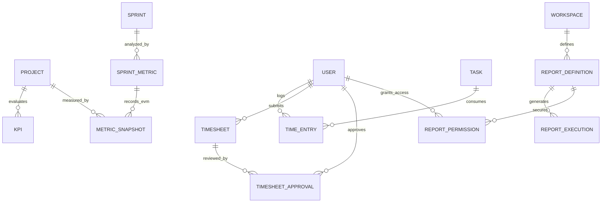

**Project**: PronaFlow 
**Version**: 1.0
**State**: Draft 
_**Last updated:** Jan 14, 2026_

---
# Entity
| Domain             | Mục tiêu             | Entity                                      | Status |
| ------------------ | -------------------- | ------------------------------------------- | -------|
| Metrics Core       | Snapshot & KPI       | [[MetricSnapshot]] [[KPI]]               | ✅ |
| Agile Analytics    | Burn-down, Velocity  | [[SprintMetric]]                            | ✅ |
| Resource Analytics | Utilization          | [[ResourceUtilization]]                     | ✅ |
| Time Tracking      | Time log & Timesheet | [[TimeEntry]] [[Timesheet]]              | ✅ |
| Approval           | Timesheet workflow   | [[TimesheetApproval]]                       | ✅ |
| Reporting          | Custom report        | [[ReportDefinition]] [[ReportExecution]] | ✅ |
| Security           | Data visibility      | [[ReportPermission]]                        | ✅ |
# ERD

# Mapping Function into Entity
|Tài liệu|Entity|
|---|---|
|Burn-down / Burn-up|SprintMetric|
|Velocity 3 sprint|SprintMetric.average_velocity|
|Heatmap|ResourceUtilization|
|Drill-down|ResourceUtilization → TimeEntry|
|Timer & Manual|TimeEntry.source|
|Billable flag|TimeEntry.is_billable|
|Timesheet approval|TimesheetApproval|
|EVM (CPI/SPI)|MetricSnapshot|
|Pareto Bug|ReportDefinition + metrics|
