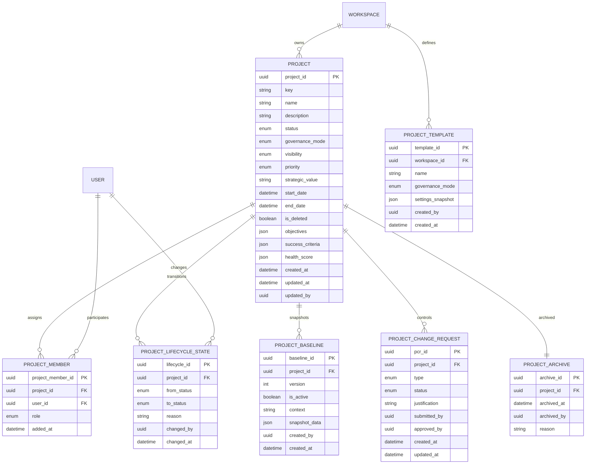

**Project**: PronaFlow 
**Version**: 1.1
**State**: Draft 
_**Last updated:** Feb 7, 2026_

---
## Quan hệ tổng thể (Cardinality)
- **Workspace 1–N Project**
- **Project 1–N ProjectMember**
- **User 1–N ProjectMember**
- **Project 1–N ProjectLifecycleState**
- **Project 1–N ProjectBaseline**
- **Project 1–N ProjectChangeRequest**
- **Workspace 1–N ProjectTemplate**
- **Project 0–1 ProjectArchive**



---
## Enum Definitions

### Project Status
```
HOLD         = 0  # Tạm dừng - Project frozen, no new tasks allowed
NOT_STARTED  = 1  # Chưa bắt đầu - Planning phase (Default)
IN_PROGRESS  = 2  # Đang thực hiện - Active execution
IN_REVIEW    = 3  # Đang đánh giá - UAT/Review phase
DONE         = 4  # Hoàn thành - Completed successfully (Read-only)
CANCELLED    = 5  # Đã hủy - Terminated early (Read-only)
```

### Governance Mode
```
SIMPLE = 'simple'  # Lightweight governance for small/agile teams
STRICT = 'strict'  # Enterprise governance with PCR, baseline approval gates
```

### Visibility
```
PUBLIC  = 'public'   # All workspace members can see and join
PRIVATE = 'private'  # Only invited members can access
```

### Priority
```
LOW      = 'low'      # Internal projects or fillers
MEDIUM   = 'medium'   # Standard projects (Default)
HIGH     = 'high'     # Key strategic projects
CRITICAL = 'critical' # Mission-critical projects with absolute resource priority
```

### Project Role
```
PROJECT_MANAGER = 'pm'       # Full project control, approves baselines & PCRs
PLANNER         = 'planner'  # Can edit Gantt, dependencies, propose baselines
MEMBER          = 'member'   # Execution focus - update tasks, log time, comment
VIEWER          = 'viewer'   # Read-only access for stakeholders
```

### PCR Type (Change Request Type)
```
SCOPE    = 'scope'     # Scope changes (add/remove features)
SCHEDULE = 'schedule'  # Timeline changes
COST     = 'cost'      # Budget changes
RESOURCE = 'resource'  # Resource allocation changes
```

### PCR Status
```
DRAFT     = 'draft'     # Being prepared
SUBMITTED = 'submitted' # Waiting for approval
APPROVED  = 'approved'  # Approved - can apply changes
REJECTED  = 'rejected'  # Rejected - changes not allowed
CANCELLED = 'cancelled' # Withdrawn by submitter
```

---
## Design Notes

### Category & Portfolio Management
**Decision:** Category and Portfolio are implemented as **denormalized string fields** in the `PROJECT` table rather than separate entities, for the following reasons:

1. **Simplicity:** Most organizations use simple tagging (e.g., "Client A", "R&D", "Strategy 2025") without complex hierarchies.
2. **Flexibility:** String/JSON fields allow quick filtering and grouping without JOIN overhead.
3. **Future-proof:** If hierarchical portfolio management is needed later (Program > Portfolio > Project), we can introduce a `PORTFOLIO` entity table and migrate the string values.

**Implementation:**
```sql
-- Add to PROJECT table
category TEXT NULL,              -- e.g., "Internal", "Client A", "R&D"
portfolio_tag TEXT NULL,         -- e.g., "Strategy 2025", "Digital Transformation"
portfolio_tags JSONB NULL        -- Alternative: array of tags for multi-portfolio projects
```

### Simulation Scenarios Storage
**Decision:** Simulation scenarios (Feature 2.14) use **ephemeral storage** (Redis/in-memory) rather than persistent DB tables.

- **Temporary snapshots:** Stored in Redis with TTL (24 hours)
- **Named scenarios:** If user saves a scenario, it's stored in `project_simulation_scenario` table with JSONB snapshot
- **Automatic cleanup:** Unsaved scenarios expire after session ends or 24h

### Health Score Calculation
**Decision:** `health_score` is stored as **JSONB** containing:
```json
{
  "overall": "green|amber|red",
  "schedule_health": 0.95,
  "resource_health": 0.85,
  "budget_health": 1.0,
  "last_calculated_at": "2026-02-07T10:00:00Z",
  "manual_override": false,
  "override_reason": null
}
```

### Baseline Snapshot Structure
**Decision:** `snapshot_data` is **JSONB** containing:
```json
{
  "version": "v1.0",
  "project_metadata": {...},
  "tasks_snapshot": [{...}],
  "dependencies_snapshot": [{...}],
  "resource_assignments": [{...}],
  "gantt_config": {...}
}
```

---
## Related Entities (Cross-Module References)

### From Module 2 (Workspace & User Management)
- `WORKSPACE` - Owner of projects
- `USER` - Members assigned to projects
- `WORKSPACE_MEMBER` - Validates that project members must be workspace members first

### From Module 4 (Task Management)
- `TASK` - Tasks belong to projects (`task.project_id`)
- `TASK_LIST` - Task lists/phases belong to projects

### From Module 5 (Temporal Planning)
- `TASK_DEPENDENCY` - Used in baseline snapshots
- `PROJECT_CALENDAR` - Working days configuration
- Impact Analysis (CIA Panel) integrates with PCR workflow

### From Module 8 (Audit & Archive)
- `AUDIT_LOG` - All project changes logged
- Archive storage strategy for DONE/CANCELLED projects