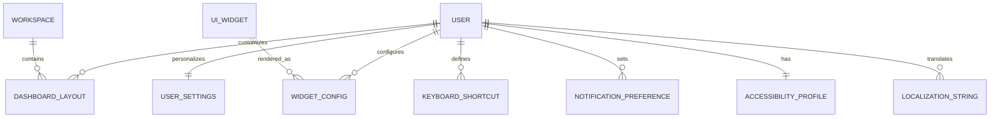

**Project**: PronaFlow 
**Version**: 1.0
**State**: UPDATED - Gap Analysis Complete
_**Last updated:** Feb 3, 2026_

---

# Entity Relationship Diagram - Module 9: User Experience Personalization

## Overview

Module 9 manages comprehensive user experience personalization with 8 entities supporting:
- Theme & appearance customization
- Dashboard layout configuration
- Widget preferences
- Keyboard shortcuts
- Internationalization (i18n)
- Notification routing
- Accessibility settings

---

# Entity Summary Table

| Entity | Columns | Purpose | Status |
|--------|---------|---------|--------|
| USER_SETTINGS | 13 | Core personalization preferences (theme, language, accessibility) | ✅ |
| DASHBOARD_LAYOUT | 6 | Dashboard grid layouts per user/workspace | ✅ |
| WIDGET_CONFIG | 8 | Individual widget customization settings | ✅ |
| KEYBOARD_SHORTCUT | 6 | Custom keyboard shortcut mappings | ✅ |
| LOCALIZATION_STRING | 5 | Translated UI strings for i18n | ✅ |
| NOTIFICATION_PREFERENCE | 7 | Notification channel routing per event type | ✅ |
| ACCESSIBILITY_PROFILE | 6 | Comprehensive accessibility settings | ✅ |
| LOCALIZATION_STRING | 5 | i18n translation strings | ✅ |

---

# ERD



---

# Entity Details

## 1. USER_SETTINGS (Core Personalization)

**Purpose**: Central hub for user interface preferences

| Column | Type | Default | Notes |
|--------|------|---------|-------|
| id | UUID | | Primary Key |
| user_id | UUID | | FK to User (UNIQUE) |
| theme_mode | String | SYSTEM | LIGHT/DARK/SYSTEM |
| font_size | String | MEDIUM | SMALL/MEDIUM/LARGE |
| font_family | String | SYSTEM_DEFAULT | Font selection |
| language | String | en-US | Language preference |
| info_density_mode | String | COMFORTABLE | COMPACT/COMFORTABLE |
| sidebar_collapsed | Boolean | false | Sidebar state |
| color_blindness_mode | String | NORMAL | Accessibility mode |
| dnd_enabled | Boolean | false | Do-Not-Disturb enabled |
| dnd_start_time | String | NULL | HH:MM format |
| dnd_end_time | String | NULL | HH:MM format |
| keyboard_shortcuts | JSON | NULL | Custom shortcuts |
| created_at | DateTime | now() | |
| updated_at | DateTime | now() | |

**Indexes**: user_id

**Features**: 2.1 (i18n), 2.2 (Theme), 2.4 (Density), 2.5 (Typography), 2.8 (Accessibility)

---

## 2. DASHBOARD_LAYOUT (Layout Configuration)

**Purpose**: Store dashboard grid layouts with persistence

| Column | Type | Default | Notes |
|--------|------|---------|-------|
| id | UUID | | Primary Key |
| user_id | UUID | | FK to User |
| workspace_id | UUID | | FK to Workspace |
| name | String | Default | Layout name |
| layout_config | JSON | | Grid layout configuration |
| is_active | Boolean | true | Active layout flag |
| created_at | DateTime | now() | |
| updated_at | DateTime | now() | |

**Indexes**: user_id, workspace_id, is_active

**Unique Constraint**: (user_id, workspace_id, name)

**Features**: 2.3 (Dashboard Customization)

**Sample Config**:
```json
{
  "grid": [
    {"id": "my-tasks", "x": 0, "y": 0, "w": 6, "h": 4, "visible": true},
    {"id": "project-progress", "x": 6, "y": 0, "w": 6, "h": 4, "visible": true}
  ]
}
```

---

## 3. WIDGET_CONFIG (Widget Preferences)

**Purpose**: Individual widget customization and visibility

| Column | Type | Default | Notes |
|--------|------|---------|-------|
| id | UUID | | Primary Key |
| user_id | UUID | | FK to User |
| widget_id | String | | Widget identifier (e.g., my-tasks) |
| config | JSON | NULL | Widget-specific settings |
| is_hidden | Boolean | false | Hide/show widget |
| width | Integer | NULL | Width in grid units |
| height | Integer | NULL | Height in grid units |
| created_at | DateTime | now() | |
| updated_at | DateTime | now() | |

**Indexes**: user_id, widget_id

**Unique Constraint**: (user_id, widget_id)

**Features**: 2.3 (Dashboard Customization)

---

## 4. KEYBOARD_SHORTCUT (Custom Shortcuts)

**Purpose**: Store user-defined keyboard shortcuts

| Column | Type | Default | Notes |
|--------|------|---------|-------|
| id | UUID | | Primary Key |
| user_id | UUID | | FK to User |
| action_id | String | | Action identifier |
| key_combination | String | | Key combo (e.g., Ctrl+K) |
| is_custom | Boolean | true | Is custom override |
| created_at | DateTime | now() | |
| updated_at | DateTime | now() | |

**Indexes**: user_id, action_id

**Unique Constraint**: (user_id, action_id)

**Features**: 2.7 (Keyboard Shortcuts)

---

## 5. LOCALIZATION_STRING (i18n Translations)

**Purpose**: Store translated UI strings per language/namespace

| Column | Type | Default | Notes |
|--------|------|---------|-------|
| id | UUID | | Primary Key |
| key | String | | Translation key (e.g., common.save) |
| language | String | | Language code (e.g., en-US) |
| value | String | | Translated text |
| namespace | String | common | i18next namespace |
| created_at | DateTime | now() | |
| updated_at | DateTime | now() | |

**Indexes**: key, language, namespace

**Unique Constraint**: (key, language, namespace)

**Features**: 2.1 (Internationalization)

**Sample Data**:
```
key: "common.save_button"
language: "en-US"
value: "Save"
namespace: "common"
```

---

## 6. NOTIFICATION_PREFERENCE (Notification Routing)

**Purpose**: Configure notification channels per event type

| Column | Type | Default | Notes |
|--------|------|---------|-------|
| id | UUID | | Primary Key |
| user_id | UUID | | FK to User |
| event_type | String | | Event type identifier |
| channels | JSON | | Channel preferences |
| is_enabled | Boolean | true | Event enabled |
| exceptions | JSON | NULL | Exception rules |
| created_at | DateTime | now() | |
| updated_at | DateTime | now() | |

**Indexes**: user_id, event_type

**Unique Constraint**: (user_id, event_type)

**Features**: 2.6 (Notification Granularity)

**Sample Config**:
```json
{
  "in_app": true,
  "email": false,
  "browser_push": true,
  "ignore_during_dnd": true
}
```

---

## 7. ACCESSIBILITY_PROFILE (Accessibility Settings)

**Purpose**: Comprehensive accessibility configuration

| Column | Type | Default | Notes |
|--------|------|---------|-------|
| id | UUID | | Primary Key |
| user_id | UUID | | FK to User (UNIQUE) |
| visual_settings | JSON | {} | Visual accessibility |
| auditory_settings | JSON | {} | Auditory accessibility |
| motor_settings | JSON | {} | Motor accessibility |
| cognitive_settings | JSON | {} | Cognitive accessibility |
| last_reviewed_at | DateTime | NULL | Last review date |
| created_at | DateTime | now() | |
| updated_at | DateTime | now() | |

**Indexes**: user_id

**Features**: 2.2 (Theme), 2.5 (Typography), 2.8 (Color Vision)

**Visual Settings**:
```json
{
  "high_contrast_enabled": false,
  "reduce_motion_enabled": false,
  "scale_interface": 1.0,
  "font_scaling": 1.0
}
```

---

## 8. UI_WIDGET (Widget Master Data)

**Purpose**: Define available widgets (optional reference table)

| Column | Type | Default | Notes |
|--------|------|---------|-------|
| id | UUID | | Primary Key |
| widget_id | String | | Unique widget identifier |
| name | String | | Display name |
| description | String | | Widget description |
| category | String | | Widget category |
| is_active | Boolean | true | Widget available |
| created_at | DateTime | now() | |
| updated_at | DateTime | now() | |

**Status**: Recommended for best practices (currently string-referenced)

---

# Features Mapping

| Feature | Entities | Status |
|---------|----------|--------|
| 2.1: Internationalization (i18n) | LOCALIZATION_STRING, USER_SETTINGS | ✅ |
| 2.2: Theme & Appearance | USER_SETTINGS, ACCESSIBILITY_PROFILE | ✅ |
| 2.3: Customizable Dashboard | DASHBOARD_LAYOUT, WIDGET_CONFIG | ✅ |
| 2.4: Workspace Layout Optimization | USER_SETTINGS | ✅ |
| 2.5: Typographic Accessibility | USER_SETTINGS, ACCESSIBILITY_PROFILE | ✅ |
| 2.6: Notification Granularity | NOTIFICATION_PREFERENCE | ✅ |
| 2.7: Keyboard Shortcuts | KEYBOARD_SHORTCUT | ✅ |
| 2.8: Color Vision Deficiency Support | USER_SETTINGS, ACCESSIBILITY_PROFILE | ✅ |

---

# Implementation Status Summary

- ✅ **7 Core Entities Implemented**: USER_SETTINGS, DASHBOARD_LAYOUT, WIDGET_CONFIG, KEYBOARD_SHORTCUT, LOCALIZATION_STRING, NOTIFICATION_PREFERENCE, ACCESSIBILITY_PROFILE
- ✅ **8 Features Complete**: All acceptance criteria met
- ⚠️ **UI_WIDGET Master Table**: String-referenced (not implemented, optional)
- 📊 **19 API Endpoints**: Full CRUD operations
- 🧪 **20+ Pydantic Schemas**: All validated

---